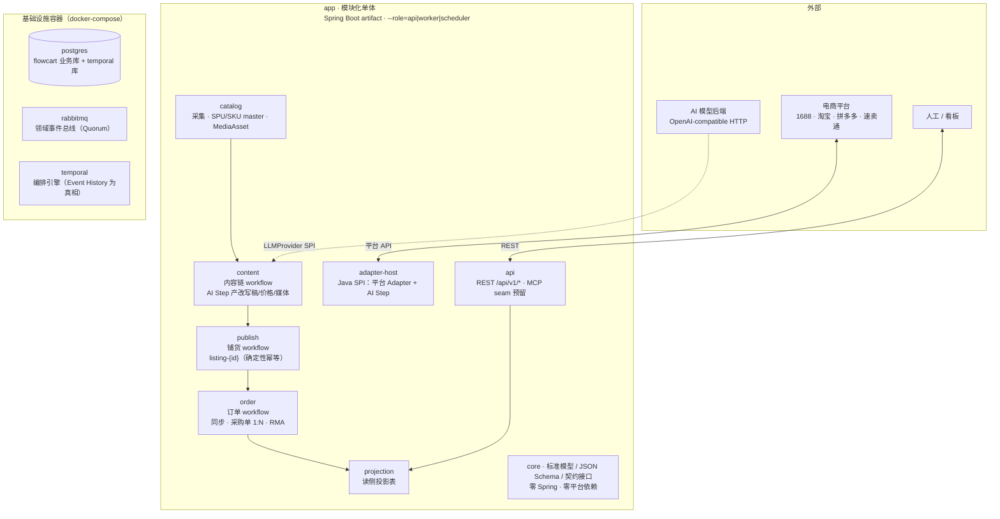
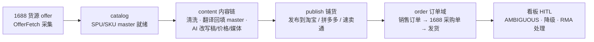

# ecom-flowcart

**一件代发（dropshipping）电商自动化工作流 —— 设计先行、将开源。**

覆盖国内（1688 → 淘宝 / 拼多多）与跨境（1688 → 速卖通）两条链路：采集货源商品 → AI 内容生产 → 平台铺货 → 订单回传 1688 采购 → 物流追踪 → 看板 HITL。

> **当前状态：实现期推进中（2026-09-25）**。设计期已收官（9 ADR + **7** Specs + 3 JSON Schema + 架构总览）；7 个 build slice（[#17](https://github.com/luochenfx/ecom-flowcart/issues/17)–[#23](https://github.com/luochenfx/ecom-flowcart/issues/23)）已全部合入 main，各 slice 交付形态为「纯 Java 域服务 + Temporal 编排壳 + 单测」。**端到端链路已打通**（[规范 0007](docs/specs/0007-end-to-end-flow-assembly.md)，[#75](https://github.com/luochenfx/ecom-flowcart/issues/75) 收官，已合入 [PR #133](https://github.com/luochenfx/ecom-flowcart/pull/133)）：编排链（`fulfillment-{spuId}-{channelId}` 以 child workflow 串联采集产物 → 内容就绪 → 铺货收敛）+ 装配根（`adapter-host` / `api` / `app` Spring 装配）+ catalog 文档库落 Postgres 均已交付。进度追踪见 [map #1](https://github.com/luochenfx/ecom-flowcart/issues/1)。

---

## 架构一览

模块化单体应用 + 三个基础设施容器（单机 docker-compose，推荐 8C16G）：



- **依赖方向**：单一规则 `core` ← 一切模块；业务模块间不直接调实现——跨模块协作经 workflow start/signal（Temporal）或领域事件（RabbitMQ，仅广播已落库事实）。三禁环由 ArchUnit 自动拦截。
- **有状态链**（content / publish / order 的 workflow）由 Temporal 编排；业务事实落 `postgres`；领域事件经 `rabbitmq` 广播；读侧只读 `projection`。
- 详细模块边界 / 资源预算 / 拆分演进信号见 [架构总览](docs/architecture.md)。

## 业务链路



- 国内 / 跨境共用同一套架构与标准模型，差异全部收在平台 Adapter。
- AI 产物先落库（`provenance.step=AI`），人工在铺货前编辑覆盖（`HUMAN`）；重铺 ≠ 重生成。

## 快速开始（本地开发）

**前置**：JDK 21 + Maven 3.9+（可选 Docker / Docker Compose v2）。依赖下载走 Aliyun Public Repository——根 pom 已声明；CI 与 Docker 构建经 `.mvn/settings-aliyun.xml` 把 Maven Central 镜像到同一地址（`-s .mvn/settings-aliyun.xml`）。

```bash
git clone https://github.com/luochenfx/ecom-flowcart.git
cd ecom-flowcart
mvn clean test        # 全 reactor 单测 + in-process Temporal 测试（不需要 docker）
docker compose up -d  # 拉起 postgres / rabbitmq / temporal / app
mvn clean verify -Pe2e  # 端到端验收（需先 docker compose up -d；默认不进 CI）
```

| 服务 | 地址 | 说明 |
|---|---|---|
| app | http://localhost:8080 | 模块化单体（骨架为 web 空壳）；健康检查 `/actuator/health` |
| postgres | localhost:5433 | `flowcart` 业务库 + `temporal`/`temporal_visibility` 库（首次初始化自建，admin-tools 引导 schema） |
| rabbitmq | localhost:5672 / UI :15672 | Quorum 领域事件总线（管理台默认 flowcart/flowcart） |
| temporal | localhost:7233 | 编排引擎；可选看板 `docker compose --profile ui up -d` → http://localhost:8081 |

- **两条测试口径**：`mvn clean test` 用 in-process Temporal（快、无依赖、进 CI）；`mvn clean verify -Pe2e` 连真 Temporal server + 真 Postgres 跑完整链路（慢、需 compose，作为手动 / 夜间验收）。口径见 [规范 0007](docs/specs/0007-end-to-end-flow-assembly.md) §9。
- 本地开发默认凭据 `flowcart/flowcart`；生产覆盖见 `.env.example`（复制为 `.env` 后改，`.env` 不入库）。
- 首次 `docker compose up -d` 会自动执行两个一次性引导容器（建 Temporal schema + 注册 default namespace，幂等）；重置环境：`docker compose down -v && docker compose up -d`。
- 无 Docker 环境可跳过 compose——`mvn clean test` 不依赖任何基础设施。
- 完整部署拓扑 / 资源预算见 [docs/architecture.md](docs/architecture.md) §5；备份/恢复语义与脚本见 [docs/ops/backup-restore.md](docs/ops/backup-restore.md)。

## 文档导航

| 文档 | 说明 |
|---|---|
| [docs/architecture.md](docs/architecture.md) | **设计包总入口**：模块图 / 依赖方向 / 部署视图 / 资产索引 |
| [CONTEXT.md](CONTEXT.md) | 领域术语（Listing / SPU / Order / Adapter / AI Step / core…） |
| [docs/adr/](docs/adr/) | 决策记录 ADR-0001 ~ 0009 |
| [docs/specs/](docs/specs/) | 领域规范 Specs-0001 ~ 0007 |
| [docs/ops/backup-restore.md](docs/ops/backup-restore.md) | 备份/恢复 SOP：状态归类 + 双库 pg_dump 语义 + 恢复演练（配套 `docker/backup-postgres.sh` / `restore-postgres.sh`） |
| [schemas/](schemas/) | 机器可读契约（product-catalog / order / message） |
| [AGENTS.md](AGENTS.md) | Agent 协作约定（issue tracker / labels / domain docs） |
| [map #1](https://github.com/luochenfx/ecom-flowcart/issues/1) | 进度 wayfinder：Decisions so far + 遗留 fog |

### 关键决策速查

| ADR | 决策 |
|---|---|
| 0001 | 消息总线 = RabbitMQ（Quorum）；DLQ 隔离舱 + 信号源、绝不自愈 |
| 0002 | 编排引擎 = Temporal 自托管；有状态链进 workflow、无状态进总线 |
| 0003 | 铺货幂等 = 确定性 WorkflowId（不建幂等登记表）+ 状态机 + Adapter 错误三类 |
| 0004 | 商品模型 = SPU/SKU master + Listing 平台特化（类目多 taxonomy / JSONB / i18n / MediaAsset） |
| 0005 | 订单模型 = OrderSnapshot 一等不可变 + Order / PurchaseOrder 1:N / RMA 单实体 |
| 0006 | 窄总线单层 Domain Event + envelope 契约 + repo 即 registry |
| 0007 | 平台 Adapter = Capability 接口族 + core 零平台依赖 + Java SPI |
| 0008 | AI Step = 内容链分离 + 字段级契约 + LLMProvider SPI（模型编排插槽预留） |
| 0009 | 架构骨架 = 模块化单体 + core 依赖规则 + 单仓契约 + REST 主入口 + compose 部署 |

## Roadmap

> 随进展逐步完善；每张实现期 ticket 关闭后同步更新本表与 map #1。

- [x] **设计期收官**（2026-09-09）：9 ADR + 6 Specs + 3 JSON Schema + 架构总览 + CONTEXT 术语
- **实现期 build slices**（按序开票，一次一张）：
  - [x] **工程基建基座**（[#18](https://github.com/luochenfx/ecom-flowcart/issues/18)，已合入 [PR #25](https://github.com/luochenfx/ecom-flowcart/pull/25)）：多模块 Maven 骨架 + `docker-compose.yml` + CI 编译流水线 + 包名/JDK 定版——`mvn clean test` 空测试报告即绿
  - [x] `core-contracts`（[#17](https://github.com/luochenfx/ecom-flowcart/issues/17)，已合入 [PR #30](https://github.com/luochenfx/ecom-flowcart/pull/30)）：标准模型 POJO + 契约接口 + JSON Schema 配套测试——19 tests 绿
  - [x] `catalog`（[#19](https://github.com/luochenfx/ecom-flowcart/issues/19)，已合入 [PR #34](https://github.com/luochenfx/ecom-flowcart/pull/34)）：1688 OfferFetch 采集 → SPU/SKU/MediaAsset 落库（首个 Adapter OfferFetch 子集；adapter-1688 12 + catalog 13 tests）
  - [x] `content`（[#20](https://github.com/luochenfx/ecom-flowcart/issues/20)，已合入 [PR #41](https://github.com/luochenfx/ecom-flowcart/pull/41)）：内容链 + 首批 AI Step（翻译回填 / 改写 / 描述 / 价格策略 / 媒体处理）+ `content-{listingId}` Temporal workflow（content 56 + worker-runtime 10 tests）
  - [x] `publish`（[#21](https://github.com/luochenfx/ecom-flowcart/issues/21)，已合入 [PR #66](https://github.com/luochenfx/ecom-flowcart/pull/66)）：铺货 workflow——确定性 `listing-{productId}-{channelId}` WorkflowId 幂等 + 四态机（PUBLISHED / AMBIGUOUS 挂起 / REJECTED / FAILED）+ reconcile seam + `listing.published` / `listing.ambiguous` 事件广播（publish 27 + worker-runtime 28 tests）
  - [x] `order`（[#22](https://github.com/luochenfx/ecom-flowcart/issues/22)，已合入 [PR #65](https://github.com/luochenfx/ecom-flowcart/pull/65)）：同步（轮询 + webhook 信号）→ 采购单 → 物流（order 27 + worker-runtime 21 tests）
  - [x] （[#23](https://github.com/luochenfx/ecom-flowcart/issues/23) 前置，非 slice）货源侧采购契约补齐（[#35](https://github.com/luochenfx/ecom-flowcart/issues/35)，已合入 [PR #38](https://github.com/luochenfx/ecom-flowcart/pull/38)）：`OfferSku.sourceSpecId` / `PurchaseDraftItem.sourceOfferId` / `PurchaseCapability.cancelPurchase` + `payPurchase`，并在 `specs/0005` 新增 §9.1 1688 侧逐项能力映射表
  - [x] 1688 Adapter 全能力收口 + Adapter 贡献门槛模板（[#23](https://github.com/luochenfx/ecom-flowcart/issues/23)，已合入 [PR #42](https://github.com/luochenfx/ecom-flowcart/pull/42)）：四段 Purchase（建单 / 取消 / 支付 / 物流）+ OAuth 换票 + 签名网关与限流 + 双向 fixture 门槛（契约前置 [#35](https://github.com/luochenfx/ecom-flowcart/issues/35) 已完成）；review 派生收口链 [#44](https://github.com/luochenfx/ecom-flowcart/issues/44)、[#45](https://github.com/luochenfx/ecom-flowcart/issues/45)、[#46](https://github.com/luochenfx/ecom-flowcart/issues/46) 均已收口（[PR #64](https://github.com/luochenfx/ecom-flowcart/pull/64) / [PR #63](https://github.com/luochenfx/ecom-flowcart/pull/63) / [PR #62](https://github.com/luochenfx/ecom-flowcart/pull/62)）
- [x] **端到端链路打通**（[#75](https://github.com/luochenfx/ecom-flowcart/issues/75)，已合入 [PR #133](https://github.com/luochenfx/ecom-flowcart/pull/133)；[规范 0007](docs/specs/0007-end-to-end-flow-assembly.md)，2026-09-21 设计定稿）：编排链（`fulfillment-{spuId}-{channelId}` 以 child workflow 串联采集产物 → 内容就绪断言 → 铺货收敛）+ 装配根（`adapter-host.AdapterHost` / `api` REST 入口 / `app` Spring 装配）+ catalog 文档库落 Postgres + `adapter-fake` 测试 Adapter + e2e 验收
- [ ] 开源发布准备（[#24](https://github.com/luochenfx/ecom-flowcart/issues/24)：README 完善 / 示例数据 / 贡献指南）

## License

[MIT](LICENSE)
