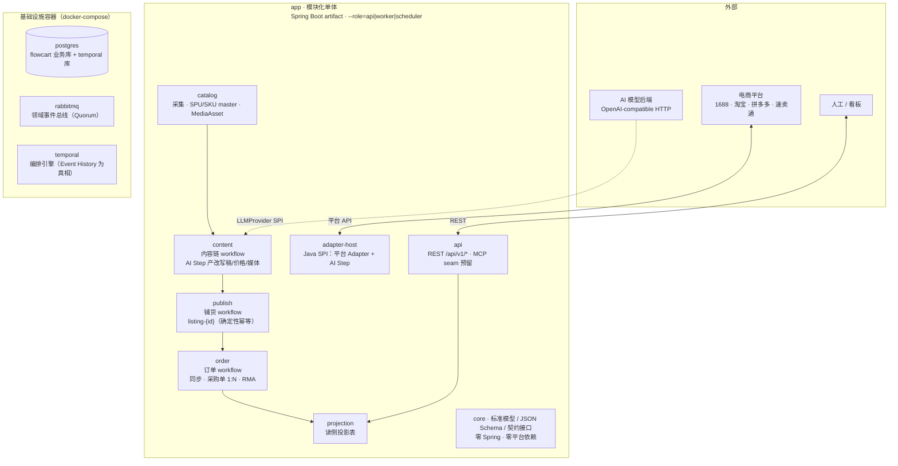
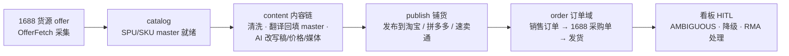

# ecom-flowcart

**一件代发（dropshipping）电商自动化工作流 —— 设计先行、将开源。**

覆盖国内（1688 → 淘宝 / 拼多多）与跨境（1688 → 速卖通）两条链路：采集货源商品 → AI 内容生产 → 平台铺货 → 订单回传 1688 采购 → 物流追踪 → 看板 HITL。

> **当前状态：设计期已收官（2026-09-09）**。全部开放决策已收敛为 v1 设计包（9 篇 ADR + 6 篇 Specs + 3 份 JSON Schema 契约 + 架构总览）；实现期按 build slices 推进（见 [Roadmap](#roadmap)）。进度追踪见 [map #1](https://github.com/luochenfx/ecom-flowcart/issues/1)。

---

## 架构一览

模块化单体应用 + 三个基础设施容器（单机 docker-compose，推荐 8C16G）：



- **依赖方向**：单一规则 `core` ← 一切模块；业务模块间不直接调实现——跨模块协作经 workflow start/signal（Temporal）或领域事件（RabbitMQ，仅广播已落库事实）。三禁环由 ArchUnit 自动拦截。
- **有状态链**（content / publish / order 的 workflow）由 Temporal 编排；业务事实落 `postgres`；领域事件经 `rabbitmq` 广播；读侧只读 `projection`。
- 详细模块边界 / 资源预算 / 拆分演进信号见 [架构总览](docs/architecture.md)。

## 业务链路



- 国内 / 跨境共用同一套架构与标准模型，差异全部收在平台 Adapter。
- AI 产物先落库（`provenance.step=AI`），人工在铺货前编辑覆盖（`HUMAN`）；重铺 ≠ 重生成。

## 快速开始（本地开发）

**前置**：JDK 21 + Maven 3.9+（可选 Docker / Docker Compose v2）。依赖下载走 Aliyun Public Repository——根 pom 已声明；CI 与 Docker 构建经 `.mvn/settings-aliyun.xml` 把 Maven Central 镜像到同一地址（`-s .mvn/settings-aliyun.xml`）。

```bash
git clone https://github.com/luochenfx/ecom-flowcart.git
cd ecom-flowcart
mvn clean test        # 工程基座（ticket #18）：无业务代码时输出空测试报告即绿
docker compose up -d  # 拉起 postgres / rabbitmq / temporal / app
```

| 服务 | 地址 | 说明 |
|---|---|---|
| app | http://localhost:8080 | 模块化单体（骨架为 web 空壳）；健康检查 `/actuator/health` |
| postgres | localhost:5433 | `flowcart` 业务库 + `temporal`/`temporal_visibility` 库（首次初始化自建，admin-tools 引导 schema） |
| rabbitmq | localhost:5672 / UI :15672 | Quorum 领域事件总线（管理台默认 flowcart/flowcart） |
| temporal | localhost:7233 | 编排引擎；可选看板 `docker compose --profile ui up -d` → http://localhost:8081 |

- 本地开发默认凭据 `flowcart/flowcart`；生产覆盖见 `.env.example`（复制为 `.env` 后改，`.env` 不入库）。
- 首次 `docker compose up -d` 会自动执行两个一次性引导容器（建 Temporal schema + 注册 default namespace，幂等）；重置环境：`docker compose down -v && docker compose up -d`。
- 无 Docker 环境可跳过 compose——`mvn clean test` 不依赖任何基础设施。
- 完整部署拓扑 / 资源预算见 [docs/architecture.md](docs/architecture.md) §5；备份/恢复语义与脚本见 [docs/ops/backup-restore.md](docs/ops/backup-restore.md)。

## 文档导航

| 文档 | 说明 |
|---|---|
| [docs/architecture.md](docs/architecture.md) | **设计包总入口**：模块图 / 依赖方向 / 部署视图 / 资产索引 |
| [CONTEXT.md](CONTEXT.md) | 领域术语（Listing / SPU / Order / Adapter / AI Step / core…） |
| [docs/adr/](docs/adr/) | 决策记录 ADR-0001 ~ 0009 |
| [docs/specs/](docs/specs/) | 领域规范 Specs-0001 ~ 0006 |
| [docs/ops/backup-restore.md](docs/ops/backup-restore.md) | 备份/恢复 SOP：状态归类 + 双库 pg_dump 语义 + 恢复演练（配套 `docker/backup-postgres.sh` / `restore-postgres.sh`） |
| [schemas/](schemas/) | 机器可读契约（product-catalog / order / message） |
| [AGENTS.md](AGENTS.md) | Agent 协作约定（issue tracker / labels / domain docs） |
| [map #1](https://github.com/luochenfx/ecom-flowcart/issues/1) | 进度 wayfinder：Decisions so far + 遗留 fog |

### 关键决策速查

| ADR | 决策 |
|---|---|
| 0001 | 消息总线 = RabbitMQ（Quorum）；DLQ 隔离舱 + 信号源、绝不自愈 |
| 0002 | 编排引擎 = Temporal 自托管；有状态链进 workflow、无状态进总线 |
| 0003 | 铺货幂等 = 确定性 WorkflowId（不建幂等登记表）+ 状态机 + Adapter 错误三类 |
| 0004 | 商品模型 = SPU/SKU master + Listing 平台特化（类目多 taxonomy / JSONB / i18n / MediaAsset） |
| 0005 | 订单模型 = OrderSnapshot 一等不可变 + Order / PurchaseOrder 1:N / RMA 单实体 |
| 0006 | 窄总线单层 Domain Event + envelope 契约 + repo 即 registry |
| 0007 | 平台 Adapter = Capability 接口族 + core 零平台依赖 + Java SPI |
| 0008 | AI Step = 内容链分离 + 字段级契约 + LLMProvider SPI（模型编排插槽预留） |
| 0009 | 架构骨架 = 模块化单体 + core 依赖规则 + 单仓契约 + REST 主入口 + compose 部署 |

## Roadmap

> 随进展逐步完善；每张实现期 ticket 关闭后同步更新本表与 map #1。

- [x] **设计期收官**（2026-09-09）：9 ADR + 6 Specs + 3 JSON Schema + 架构总览 + CONTEXT 术语
- [ ] **实现期 build slices**（按序开票，一次一张）：
  - [ ] **工程基建基座**（[#18](https://github.com/luochenfx/ecom-flowcart/issues/18)）：多模块 Maven 骨架 + `docker-compose.yml` + CI 编译流水线 + 包名/JDK 定版——`mvn clean test` 空测试报告即绿
  - [ ] `core-contracts`（[#17](https://github.com/luochenfx/ecom-flowcart/issues/17)）：标准模型 POJO + 契约接口 + JSON Schema 配套测试
  - [ ] `catalog`（[#19](https://github.com/luochenfx/ecom-flowcart/issues/19)）：1688 OfferFetch 采集 → SPU/SKU/MediaAsset 落库
  - [ ] `content`（[#20](https://github.com/luochenfx/ecom-flowcart/issues/20)）：内容链 + 首批 AI Step（翻译回填 / 改写 / 价格）
  - [ ] `publish`（[#21](https://github.com/luochenfx/ecom-flowcart/issues/21)）：铺货 workflow（含 reconcile seam）
  - [ ] `order`（[#22](https://github.com/luochenfx/ecom-flowcart/issues/22)）：同步（轮询 + webhook 信号）→ 采购单 → 物流
  - [ ] 首个平台 Adapter（[#23](https://github.com/luochenfx/ecom-flowcart/issues/23)，1688 优先实测）落地双向 fixture 门槛
- [ ] 开源发布准备（[#24](https://github.com/luochenfx/ecom-flowcart/issues/24)：README 完善 / 示例数据 / 贡献指南）

## License

[MIT](LICENSE)
